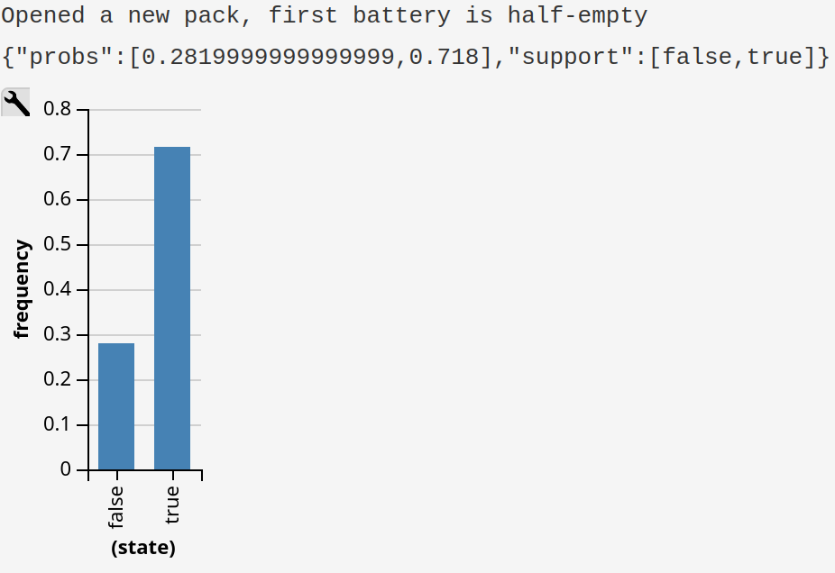

# Probabilistic Programming

You bought a 4-pack of no-name supermarket AA batteries. Sure, they were cheap, but there is also a 10% probability that any one battery will already be half-empty when bought brand new. Questions:

a.) instead of buying the pack, you received an opened (but unused, meaning that the battery charge is the same as it was when bought) 4-pack from a friend. The friend casually mentions that at least one of the batteries is empty. What is the probability that there are three full batteries in the pack?

b.) you opened a new pack yourself, took out the first battery and measured the charge. It was half-empty. What is the probability that the remaining three batteries are full?

Answer the questions using a generative model and probabilistic programming.

## Results

The given task has been finalized using webppl probabilistic programming language on webppl.org

The results are following:

The first question a.) had me wondering, that should I count just the three full batteries or if there are three or more full batteries in the pack. Not to delve into semantics, I check for both.

Here are the results for three or more full batteries, which shows that there is a 95% chance of having more three or more full batteries for 10000 opened packs:

Here are the results for just three full batteries, which shows that there is a 71% chance of having just three full batteries for 10000 opened packs:

Here are the results for three full batteries, after regarding the first battery as empty. This shows that there is a 72% chance of having three full batteries for 10000 opened packs where the first battery is always empty:

## How to execute
This program has been made and only tested on webppl.org

Opening the website and executing the webppl.js code in this repository should give around the same results as shown on the screenshots.